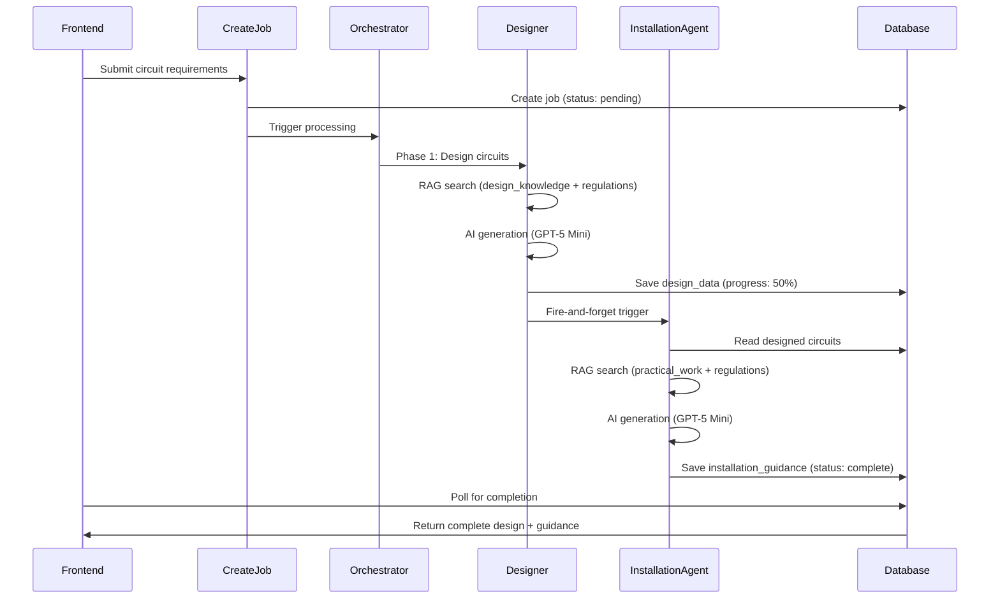

# Circuit Designer Agent

## Overview

The Circuit Designer is a multi-agent system that generates BS 7671:2018+A2:2024 compliant electrical circuit designs. It operates in two sequential phases: the **Designer Agent** generates circuit specifications, then the **Design Installation Agent** produces installation guidance for those specific designs.

## Agents Involved

| Agent | Edge Function | Core Logic | Purpose |
|-------|---------------|------------|---------|
| **Designer Agent** | `designer-agent-v3` | `design-pipeline.ts` | Circuit calculations, cable sizing, protection selection |
| **Design Installation Agent** | `design-installation-agent` | Direct in function | Installation guidance for designed circuits |

## Entry Points

- **Frontend**: `src/components/electrician-tools/ai-installation-designer/` components
- **Job Creation**: `supabase/functions/create-circuit-design-job/index.ts`
- **Orchestrator**: `supabase/functions/process-circuit-design-parallel/index.ts`
- **Designer Agent**: `supabase/functions/designer-agent-v3/index.ts`
- **Installation Agent**: `supabase/functions/design-installation-agent/index.ts`

## AI Model

- **Designer Agent**: GPT-5 Mini (`gpt-5-mini-2025-08-07`) via OpenAI API
- **Installation Agent**: GPT-5 Mini (`gpt-5-mini-2025-08-07`) via OpenAI API

## RAG Usage

### Designer Agent RAG Sources

| Table | Search Function | Purpose |
|-------|-----------------|---------|
| `design_knowledge_intelligence` | `searchDesignIntelligence()` | Cable sizing tables, BS 7671 calculations, formulas |
| `regulations_intelligence` | `searchRegulationsIntelligence()` | BS 7671 compliance rules, Zs limits, disconnection times |

### Installation Agent RAG Sources

| Table | Search Function | Purpose |
|-------|-----------------|---------|
| `practical_work_intelligence` | `searchPracticalWorkIntelligence()` | Installation procedures, tools, safety |
| `regulations_intelligence` | `searchRegulationsIntelligence()` | Verification/testing regulations |

### Keyword Extraction

The `design-keyword-extractor.ts` generates 50-150+ targeted keywords across 12 categories:
- Calculations (Ib, In, Iz, Zs, R1+R2, mV/A/m)
- Cable Selection (sizing tables, installation methods)
- Protection (MCB/RCBO/RCD devices)
- Earthing (TN-S, TN-C-S, TT systems)
- Diversity factors
- Sector-specific (domestic/commercial/industrial)
- Load Types (cooker, shower, socket, EV, etc.)
- Special Locations (bathroom zones, outdoor)

## Internal Flow



## Input

```typescript
interface CircuitDesignInput {
  projectInfo: {
    name: string;
    installationType: 'domestic' | 'commercial' | 'industrial';
    location?: string;
  };
  supply: {
    voltage: number;      // 230 or 400
    phases: '1' | '3';
    earthingSystem: 'TN-S' | 'TN-C-S' | 'TT';
    Ze?: number;
  };
  circuits: Array<{
    name: string;
    loadType: string;     // socket, cooker, shower, lighting, etc.
    loadPower: number;    // Watts
    cableLength: number;  // metres
    installationMethod?: string;
  }>;
  additionalPrompt?: string;
  specialRequirements?: string[];
}
```

## Output

### Designer Agent Output (per circuit)

```typescript
interface CircuitDesign {
  name: string;
  loadType: string;
  cableSpec: string;           // e.g., "2.5mm² twin and earth"
  cableType: string;           // e.g., "twin and earth", "SWA", "LSZH singles"
  protectionDevice: string;    // e.g., "32A Type B MCB"
  installationMethod: string;  // e.g., "Reference method C"
  enclosureType: string;       // e.g., "pvc-conduit", "steel-trunking", "none"
  calculations: {
    Ib: number;                // Design current (A)
    In: number;                // Nominal rating (A)
    Iz: number;                // Current-carrying capacity (A)
    voltageDrop: number;       // mV
    voltageDropPercent: number;
    Zs: number;                // Earth fault loop impedance (Ω)
    maxZs: number;             // Maximum permissible Zs (Ω)
    disconnectionTime: string; // e.g., "0.4s"
    diversityFactor: number;
    diversifiedLoad: number;
  };
  justification: string;       // BS 7671 compliance reasoning
  complianceStatus: 'pass' | 'warning' | 'fail';
  expectedTests?: {
    continuity: number;
    insulation: number;
    Zs: number;
    polarity: string;
  };
}
```

### Installation Agent Output (per circuit)

```typescript
interface InstallationGuidance {
  executiveSummary: string;
  safetyConsiderations: string[];
  materialsRequired: Array<{
    item: string;
    quantity: string;
    specification: string;
  }>;
  toolsRequired: string[];
  cableRouting: string[];
  terminationRequirements: string[];
  installationProcedure: Array<{
    step: number;
    description: string;
    safetyNote?: string;
    bsReference?: string;
  }>;
  testingRequirements: Array<{
    test: string;
    expectedReading: string;
    regulation: string;
  }>;
}
```

## Job Database Table

**Table**: `circuit_design_jobs`

| Column | Type | Description |
|--------|------|-------------|
| `id` | UUID | Job identifier |
| `user_id` | UUID | Owner |
| `status` | TEXT | pending, processing, complete, failed |
| `progress` | INTEGER | 0-100 overall progress |
| `designer_status` | TEXT | Designer agent status |
| `designer_progress` | INTEGER | Designer agent progress |
| `installation_agent_status` | TEXT | Installation agent status |
| `installation_agent_progress` | INTEGER | Installation agent progress |
| `job_inputs` | JSONB | Original request |
| `design_data` | JSONB | Designer output |
| `installation_guidance` | JSONB | Installation agent output |
| `error_message` | TEXT | Error details if failed |

## Cache Strategy

**Table**: `circuit_design_cache_v4`

- **Cache Key**: Hash of supply + circuits configuration
- **TTL**: 30 days
- **Hit Strategy**: Exact match on job inputs
- **Storage**: Complete design output including installation guidance

## Validation & Safety

1. **Ring Final Detection**: Circuits with 32A protection on 2.5mm² automatically classified as ring finals per BS 7671 Appendix 15
2. **Socket RCD Protection**: All socket circuits require RCD/RCBO protection per BS 7671 Reg 411.3.3
3. **Fire Circuit Cables**: Fire safety circuits (emergency lighting, fire alarm) force FP200/MICC cables
4. **Compliance Status**: Based on Zs ≤ maxZs and voltage drop ≤ 5%

## Developer Notes

### Modifying the Designer Agent

1. **Cable Selection Logic**: Edit `design-pipeline.ts` for cable type rules
2. **RAG Keywords**: Expand `design-keyword-extractor.ts` for better RAG hits
3. **AI Prompt**: System prompt is in `design-pipeline.ts` - maintain UK English and BS 7671 citations

### Modifying Installation Agent

1. **RAG Sources**: Uses `searchPracticalWorkIntelligence()` with `tradeFilter: 'installer'`
2. **Output Schema**: Defined in `design-installation-agent/index.ts`

### Timeout Configuration

- **Designer Agent**: 300 seconds (set in config.toml)
- **Installation Agent**: 300 seconds
- **Total Job**: 600 seconds maximum

### Common Issues

- **Job stuck at 50%**: Designer completed but Installation Agent failed to trigger - check fire-and-forget invocation
- **Job stuck at 90%**: Installation Agent timed out - check for HTTP connection issues
- **Empty RAG results**: Verify `design_knowledge_intelligence` has records with matching keywords
