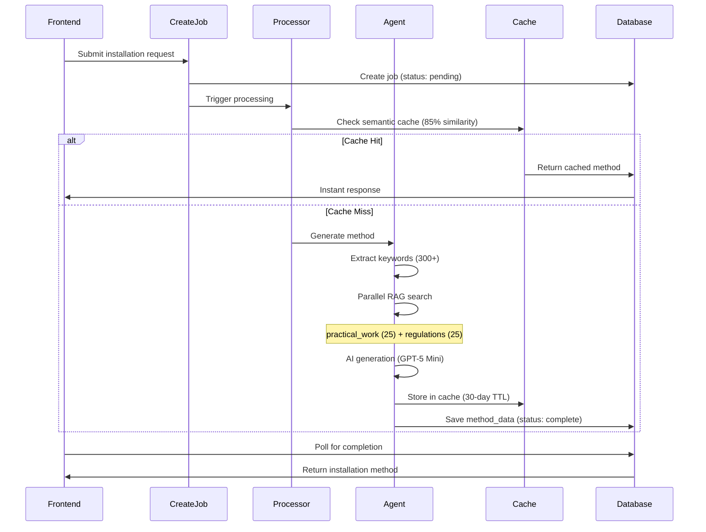

# Installation Specialist Agent

## Overview

The Installation Specialist is a standalone agent that generates comprehensive step-by-step installation method statements for electrical work. It provides detailed procedures, tools, materials, safety precautions, and BS 7671 regulation references. This agent is **separate from** the Circuit Designer's installation guidance - it operates independently for users who need installation procedures without a full circuit design.

## Agents Involved

| Agent | Edge Function | Core Logic | Purpose |
|-------|---------------|------------|---------|
| **Installation Method Agent** | `installer-v3` | `_agents/installation-method-core.ts` | Generate installation procedures |

## Entry Points

- **Frontend**: `src/components/electrician-tools/installation-specialist/InstallationSpecialistInterface.tsx`
- **Page**: `src/pages/electrician-tools/InstallationSpecialistPage.tsx`
- **Job Creation**: `supabase/functions/create-installation-method-job/index.ts`
- **Job Processor**: `supabase/functions/process-installation-method-job/index.ts`
- **Agent Core**: `supabase/functions/_agents/installation-method-core.ts`

## AI Model

- **Primary**: GPT-5 Mini (`gpt-5-mini-2025-08-07`) via OpenAI API
- **Response Format**: JSON object via `response_format: { type: 'json_object' }`

## RAG Usage

### RAG Sources

| Table | Search Function | Results Limit | Purpose |
|-------|-----------------|---------------|---------|
| `practical_work_intelligence` | `searchPracticalWorkIntelligence()` | 25 | Installation procedures, timing, tools |
| `regulations_intelligence` | `searchRegulationsIntelligence()` | 25 | BS 7671 compliance rules |

### Keyword Extraction

The `extractInstallationKeywords()` function generates 300+ keywords across 10 categories:

1. **Installation Activities**: site survey, isolation, cable pulling, termination, first fix, second fix
2. **Testing**: continuity, insulation resistance, Zs, RCD tests, polarity
3. **Tools**: MFT, Megger, screwdrivers, crimpers, cable cutters
4. **Materials**: cables, containment, accessories, distribution
5. **Safety**: safe isolation, PPE, hazards, regulations
6. **Sectors**: domestic, commercial, industrial, agricultural
7. **Special Locations**: bathroom zones, outdoor, garage
8. **Circuit Types**: ring final, radial, lighting, cooker, shower, EV
9. **Fault Finding**: symptoms, diagnostic tests
10. **Three-Phase**: 400V systems, motors, phase rotation

## Internal Flow



## Input

```typescript
interface InstallationMethodRequest {
  query: string;                    // Description of installation work
  projectDetails?: {
    projectName?: string;
    location?: string;
    buildingType?: 'domestic' | 'commercial' | 'industrial';
    accessConstraints?: string;
  };
  designerContext?: {               // Optional: from Circuit Designer handoff
    circuits?: Array<{
      name: string;
      cableSpec: string;
      protection: string;
      installationMethod: string;
    }>;
  };
}
```

## Output

```typescript
interface InstallationMethod {
  fullMethodStatement: {
    projectOverview: string;
    scopeOfWork: string;
    regulatoryReferences: string[];
  };
  executiveSummary: {
    cableType: string;
    cableSize: string;
    runLength: string;
    installationMethod: string;
    supplyType: string;
    protectiveDevice: string;
    voltageDrop: string;
    zsRequirement: string;
    purpose: string;
  };
  installationSteps: Array<{
    stepNumber: number;
    title: string;
    content: string;
    safety: string[];
    toolsRequired: string[];
    materialsNeeded: string[];
    duration: string;
    linkedHazards: string[];      // 2-4 specific hazards for this step
    bsReferences: string[];       // 2-4 BS 7671 citations
  }>;
  materialsList: Array<{
    description: string;
    specification: string;
    quantity: string;
    unit: string;
    notes: string;
  }>;
  testingRequirements: Array<{
    description: string;
    regulation: string;
    expectedReading: string;
    passRange: string;
  }>;
  safetyRequirements: {
    ppe: string[];
    isolation: string[];
    permits: string[];
    emergencyProcedures: string[];
  };
}
```

## Job Database Table

**Table**: `installation_method_jobs`

| Column | Type | Description |
|--------|------|-------------|
| `id` | UUID | Job identifier |
| `user_id` | UUID | Owner |
| `status` | TEXT | pending, processing, complete, failed, cancelled |
| `progress` | INTEGER | 0-100 |
| `current_step` | TEXT | Current processing stage |
| `job_inputs` | JSONB | Original request |
| `method_data` | JSONB | Generated installation method |
| `quality_metrics` | JSONB | RAG quality scores |
| `error_message` | TEXT | Error details if failed |

## Cache Strategy

**Table**: `installation_method_cache`

- **Similarity Threshold**: 85%
- **TTL**: 30 days
- **Cache Key**: Semantic embedding of query
- **Performance**: Cache hit returns in <500ms vs 2-3 minutes for full generation

### Cache Functions

```typescript
// Check cache
checkInstallationMethodCache({
  supabase,
  query: string,
  openAiKey: string
}): Promise<{ hit: boolean; data?: any; similarity?: number; hitCount?: number }>

// Store in cache
storeInstallationMethodCache({
  supabase,
  query: string,
  installationMethod: any,
  openAiKey: string
}): Promise<void>
```

## Validation & Safety

1. **UK English**: All output uses British spelling (earthing, metres, colour)
2. **BS 7671 Citations**: Each step includes specific regulation references
3. **Hazard Linking**: Each step identifies 2-4 specific safety hazards
4. **Tool Validation**: Tools match the specific installation activity
5. **Duration Estimates**: Based on RAG timing benchmarks

## Developer Notes

### Modifying the Agent

1. **Keyword Categories**: Edit `INSTALLATION_ACTIVITY_KEYWORDS`, `TOOLS_KEYWORDS`, etc. in `installation-method-core.ts`
2. **AI Prompt**: System prompt in `callInstallationMethodAI()` function
3. **Output Schema**: JSON schema defined via tool calling

### Timeout Configuration

```toml
# In supabase/config.toml
[functions.process-installation-method-job]
verify_jwt = true
timeout = 180  # 3 minutes
```

### Testing the Agent

```typescript
// Direct invocation (without job system)
const { data } = await supabase.functions.invoke('installer-v3', {
  body: {
    query: 'Install a 32A shower circuit in bathroom',
    projectDetails: { buildingType: 'domestic' }
  }
});
```

### Common Issues

- **Empty RAG results**: Verify keyword extraction matches database content
- **JSON parse errors**: Ensure "json" word appears in system prompt for OpenAI
- **Timeout**: Complex queries may exceed 180s - consider simplifying request
- **Missing tools/materials**: Check `toolsRequired` and `materialsNeeded` field mapping in frontend
