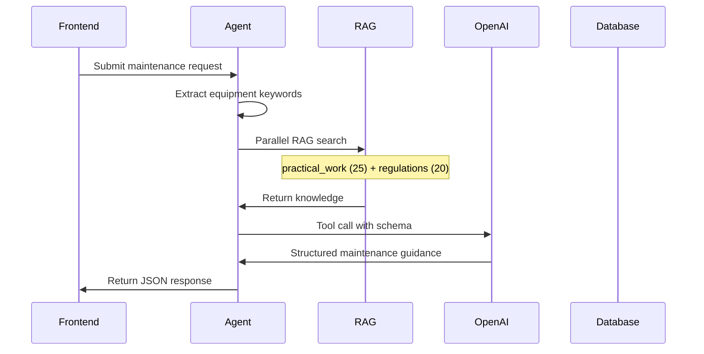

# Maintenance Specialist Agent

## Overview

The Maintenance Specialist generates comprehensive maintenance instructions for electrical equipment. It provides periodic inspection schedules, testing procedures, servicing tasks, common fault diagnosis, and BS 7671 compliance documentation. The output is designed to be PDF-ready for on-site use.

## Agents Involved

| Agent | Edge Function | Core Logic | Purpose |
|-------|---------------|------------|---------|
| **Maintenance Agent** | `maintenance-v3` | Direct in function | Generate maintenance procedures |

## Entry Points

- **Frontend**: `src/components/electrician-tools/maintenance-method/MaintenanceMethodInterface.tsx`
- **Page**: `src/pages/electrician-tools/MaintenancePage.tsx`
- **Agent**: `supabase/functions/maintenance-v3/index.ts`

## AI Model

- **Primary**: GPT-5 Mini (`gpt-5-mini-2025-08-07`) via OpenAI API
- **Response Format**: JSON object with structured schema
- **Note**: GPT-5 uses `max_completion_tokens` instead of `max_tokens`, and does not support `temperature` parameter

## RAG Usage

### RAG Sources

| Table | Search Function | Results Limit | Purpose |
|-------|-----------------|---------------|---------|
| `practical_work_intelligence` | `searchPracticalWorkIntelligence()` | 25 | Maintenance procedures, fault patterns |
| `regulations_intelligence` | `searchRegulationsIntelligence()` | 20 | BS 7671 Chapter 64 (Inspection & Testing) |

### RAG Search Categories

The agent searches with maintenance-specific filters:
- `maintenance`
- `periodic inspection`
- `testing`
- `fault diagnosis`
- `servicing`
- `EICR`
- Equipment-specific keywords (consumer unit, shower, EV charger, etc.)

## Internal Flow



## Input

```typescript
interface MaintenanceRequest {
  query?: string;                    // Equipment description
  equipmentDescription?: string;     // Alternative to query
  equipmentType?: string;            // e.g., "consumer unit", "shower"
  installationAge?: string;          // e.g., "5 years", "pre-2000"
  ageYears?: number;
  maintenanceType?: 'preventive' | 'reactive' | 'periodic_inspection';
  location?: string;
  buildingType?: string;
  environment?: string;
  criticality?: 'low' | 'medium' | 'high';
  detailLevel?: string;
}
```

## Output

```typescript
interface MaintenanceGuidance {
  response: string;                  // Overview (300-400 words)
  
  equipmentSummary: {
    equipmentType: string;
    location: string;
    installationAge: string;
    maintenanceType: 'preventive' | 'reactive' | 'periodic_inspection';
    overallRiskLevel: 'low' | 'medium' | 'high';
  };
  
  preWorkRequirements: Array<{
    category: 'isolation' | 'ppe' | 'access' | 'permits' | 'tools';
    requirement: string;
    mandatory: boolean;
    bs7671Reference?: string;
  }>;
  
  visualInspection: Array<{
    stepNumber: number;
    checkpoint: string;
    acceptanceCriteria: string;
    failureAction: string;
    bs7671Reference?: string;
  }>;
  
  testingProcedures: Array<{
    testName: string;
    testType: 'dead' | 'live';
    sequence: number;
    instrumentRequired: string;
    instrumentSettings: string;
    procedure: string[];
    expectedResult: {
      value: string;
      unit: string;
      passFailCriteria: string;
    };
    bs7671Reference?: string;
  }>;
  
  servicingTasks: Array<{
    component: string;
    task: string;
    frequency: string;
    torqueSettings?: string;
    consumables: string[];
    procedure: string[];
  }>;
  
  documentation: {
    recordsRequired: string[];
    signOffRequirements: string[];
    nextDueCalculation: string;
    certificatesIssued: string[];
  };
  
  commonFaults: Array<{
    symptom: string;
    likelyCauses: string[];
    diagnosisSteps: string[];
    remedialAction: string;
    partsRequired: string[];
  }>;
  
  maintenanceSchedule: Array<{
    interval: string;              // e.g., "Annual", "Every 5 years"
    task: string;
    priority: 'high' | 'medium' | 'low';
    regulation?: string;
    estimatedDurationMinutes?: number;
    estimatedCost?: { min: number; max: number };
    requiredQualifications?: string[];
    toolsRequired?: string[];
    procedure?: string[];
    safetyPrecautions?: string[];
    taskCategory?: 'inspection' | 'testing' | 'maintenance' | 'replacement';
  }>;
  
  qualityRequirements: Array<{
    stage: string;
    requirement: string;
    criteria: string;
  }>;
  
  bs7671References: Array<{
    regulationNumber: string;
    section: string;
    excerpt: string;
    whyApplies: string;
    confidence: number;
    consequence: string;
    relatedRegs?: string[];
  }>;
}
```

## Validation & Safety

1. **UK English**: British spelling throughout (earthing, colour, metres)
2. **BS 7671 Compliance**: References Chapter 64 for inspection/testing
3. **GN3 Guidance**: Incorporates Guidance Note 3 testing procedures
4. **Acceptance Criteria**: Each test has specific pass/fail values
5. **Tool Specifications**: Exact instrument settings provided

## Developer Notes

### Modifying the Agent

1. **System Prompt**: `MAINTENANCE_SYSTEM_PROMPT` constant in `maintenance-v3/index.ts`
2. **Tool Schema**: `MAINTENANCE_TOOL_SCHEMA` defines output structure
3. **RAG Keywords**: Edit keyword expansion in the serve function

### Tool Schema Requirements

The agent uses OpenAI tool calling with strict schema:
- `response` - Required overview text
- `equipmentSummary` - Required equipment context
- `preWorkRequirements` - Required pre-work items
- `visualInspection` - Required inspection checkpoints
- `testingProcedures` - Required tests with expected values
- `maintenanceSchedule` - Required (minimum 2-4 tasks)
- `qualityRequirements` - Required quality checkpoints
- `documentation` - Required record-keeping
- `bs7671References` - Required regulation citations

### Common Issues

- **Empty maintenanceSchedule**: AI sometimes omits - prompt enforces "MUST contain at least 2-4 tasks"
- **Mixed array fields**: Ensure procedure/safetyPrecautions stay separate arrays
- **Missing torque settings**: Only applies to certain components

### Timeout Configuration

```toml
# In supabase/config.toml
[functions.maintenance-v3]
verify_jwt = true
```

Default edge function timeout applies (typically 60s for direct calls).
