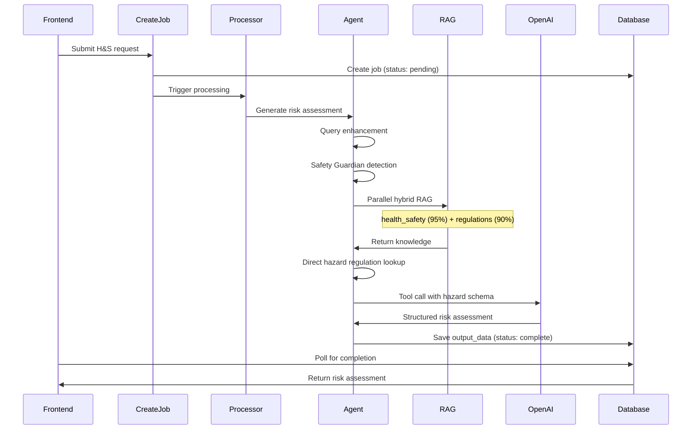

# Health & Safety Agent

## Overview

The Health & Safety Agent generates comprehensive risk assessments for electrical work. It identifies hazards, assesses risk levels (likelihood × severity), specifies control measures, determines PPE requirements, and provides emergency procedures. This agent focuses **exclusively** on risk assessment - it does NOT generate method statements or installation procedures.

## Agents Involved

| Agent | Edge Function | Core Logic | Purpose |
|-------|---------------|------------|---------|
| **Health & Safety Agent** | `health-safety-v3` | Direct in function | Risk assessment generation |

## Entry Points

- **Frontend**: `src/components/electrician-tools/health-safety/HealthSafetyInterface.tsx`
- **Page**: `src/pages/electrician-tools/HealthSafetyPage.tsx`
- **Job Creation**: `supabase/functions/create-health-safety-job/index.ts`
- **Job Processor**: `supabase/functions/process-health-safety-job/index.ts`
- **Agent**: `supabase/functions/health-safety-v3/index.ts`

## AI Model

- **Primary**: GPT-5 Mini (`gpt-5-mini-2025-08-07`) or GPT-4.1 via OpenAI API
- **Embedding**: `text-embedding-3-small` for RAG queries
- **Max Tokens**: 30,000 completion tokens

## RAG Usage

### RAG Sources (Two-Tier Hybrid Search)

| Tier | Table | Search Function | Weight | Purpose |
|------|-------|-----------------|--------|---------|
| **Tier 1** | `health_safety_knowledge` | `search_health_safety_hybrid` | 95% | HSE guidance, hazard data |
| **Tier 2** | `regulations_intelligence` | `search_regulations_intelligence_hybrid` | 90% | BS 7671 safety regulations |

### Hybrid Search Strategy

1. **Vector Search**: Query embedding compared to stored embeddings
2. **Keyword Search**: Full-text search as fallback
3. **Weight Application**: Results weighted by tier importance

### Additional Direct Lookup

The agent also directly queries `regulations_intelligence` for pre-structured hazard regulations:
- Keywords: `hazard`, `risk`, `protection`, `safety`, `shock`, `burn`, `fire`, `explosion`, `RCD`, `bonding`, `earthing`, `isolation`
- Categories: `Protection`, `Safety`, `Earthing`

## Internal Flow



## Input

```typescript
interface HealthSafetyRequest {
  query: string;                    // Work description
  workType?: string;                // Type of electrical work
  location?: string;                // Work location
  hazards?: string[];               // Pre-identified hazards
  messages?: Array<{                // Conversation history
    role: string;
    content: string;
  }>;
  previousAgentOutputs?: Array<{    // From other agents (AI RAMS)
    agent: string;
    output: any;
  }>;
  sharedRegulations?: any[];        // Pre-fetched regulations (AI RAMS)
  projectDetails?: {
    projectName?: string;
    clientName?: string;
    assessorName?: string;
  };
}
```

## Output

```typescript
interface HealthSafetyV3Response {
  success: boolean;
  data: {
    hazards: Array<{
      id: string;
      hazard: string;
      likelihood: number;         // 1-5
      severity: number;           // 1-5
      riskScore: number;          // likelihood × severity
      riskLevel: string;          // low/medium/high/very-high
      controlMeasure: string;     // Structured format with 9 sections
      residualRisk: number;
      residualRiskLevel: string;
      linkedToStep: number;       // 0 = general, 1-N = specific step
      regulation?: string;
    }>;
    ppe: Array<{
      itemNumber: number;
      ppeType: string;
      standard: string;
      mandatory: boolean;
      purpose: string;
    }>;
    emergencyProcedures: string[];
    complianceRegulations: string[];
  };
  metadata: {
    generationTimeMs: number;
    hazardCount: number;
    ppeCount: number;
    ragSourceCount: number;
    aiModel: string;
    tokensUsed?: number;
  };
}
```

### Control Measure Format

Control measures must follow this mandatory structured format:

```
PRIMARY ACTION: [Main control action]
ELIMINATE: [How to eliminate hazard]
SUBSTITUTE: [Safer alternatives]
ENGINEER CONTROLS: [Physical controls]
ADMINISTRATIVE CONTROLS: [Procedural controls]
VERIFICATION: [How to verify effectiveness]
COMPETENCY REQUIREMENT: [Required qualifications]
EQUIPMENT STANDARDS: [Equipment specifications]
REGULATION: [Applicable BS 7671 regulation]
```

## Risk Level Calculation

```typescript
function calculateRiskLevel(riskScore: number): string {
  if (riskScore >= 15) return 'very-high';
  if (riskScore >= 10) return 'high';
  if (riskScore >= 6) return 'medium';
  return 'low';
}
```

## Job Database Table

**Table**: `health_safety_jobs`

| Column | Type | Description |
|--------|------|-------------|
| `id` | UUID | Job identifier |
| `user_id` | UUID | Owner |
| `status` | TEXT | pending, processing, complete, failed, cancelled |
| `progress` | INTEGER | 0-100 |
| `current_step` | TEXT | Current processing stage |
| `project_info` | JSONB | Project metadata |
| `work_type` | TEXT | Type of work |
| `output_data` | JSONB | Generated risk assessment |
| `raw_response` | JSONB | Raw AI response |
| `error_message` | TEXT | Error details if failed |

## Validation & Safety

1. **Safety Guardian**: `detectSafetyRequirements()` pre-identifies critical hazards
2. **Query Enhancement**: `enhanceQuery()` expands queries with context
3. **RAG Validation**: Fails if zero RAG results to prevent hallucination
4. **Risk Score Validation**: Ensures likelihood and severity are 1-5 range
5. **Hazard Count**: 15-20 hazards for domestic, 20-30 for commercial/industrial

## Developer Notes

### Modifying the Agent

1. **System Prompt**: Inline in `health-safety-v3/index.ts`
2. **Response Schema**: `HealthSafetyV3Response` interface
3. **RAG Weights**: Adjust 95%/90% weights in search results mapping

### Query Enhancement

The agent uses `_shared/query-enhancer.ts` to expand queries:
- Extracts key entities from conversation history
- Adds context from previous messages
- Logs enhancement details for debugging

### Safety Guardian

`_shared/safety-guardian.ts` detects critical hazards:
- Identifies high-risk scenarios (confined spaces, live working, etc.)
- Flags mandatory PPE requirements
- Returns `criticalCount` for logging

### Timeout Configuration

```typescript
const EDGE_FUNCTION_TIMEOUT_MS = 420000; // 7 minutes
```

### Common Issues

- **Zero RAG results**: Check `health_safety_knowledge` and `regulations_intelligence` tables
- **Control measure parsing fails**: Ensure AI outputs all 9 sections with colons
- **Low hazard count**: Increase RAG limit or adjust system prompt requirements
