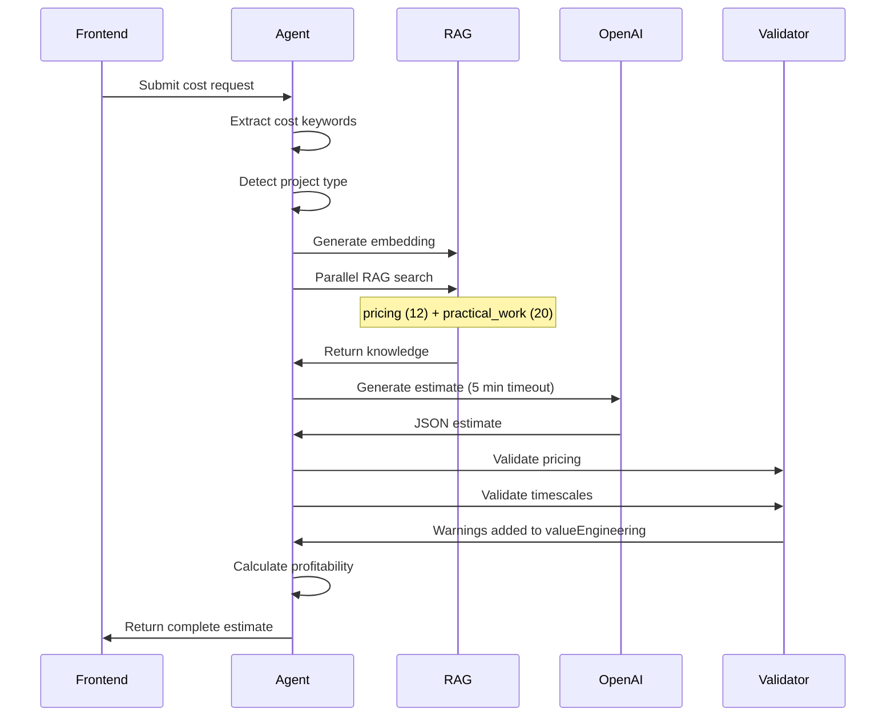

# Cost Engineer Agent

## Overview

The Cost Engineer generates detailed cost estimates for UK electrical installations. It provides itemised materials lists with trade pricing, labour breakdowns, timescales, profitability analysis, risk assessment, upsell opportunities, and payment terms. All pricing uses 2025 UK trade rates with regional multipliers.

## Agents Involved

| Agent | Edge Function | Core Logic | Purpose |
|-------|---------------|------------|---------|
| **Cost Engineer** | `cost-engineer-v3` | `_agents/cost-engineer-core.ts` | Generate cost estimates |

## Entry Points

- **Frontend**: `src/components/electrician-tools/cost-engineer/CostEngineerInterface.tsx`
- **Page**: `src/pages/electrician-tools/CostEngineerPage.tsx`
- **Agent**: `supabase/functions/cost-engineer-v3/index.ts`
- **Core Logic**: `supabase/functions/_agents/cost-engineer-core.ts`

## AI Model

- **Primary**: GPT-5 Mini (`gpt-5-mini-2025-08-07`) via OpenAI API
- **Profitability Helper**: GPT-4o Mini (`gpt-4o-mini`) - used for background profitability calculations
- **Embedding**: `text-embedding-3-small` for RAG queries
- **Max Tokens**: 12,000 completion tokens
- **Timeout**: 5 minutes (300,000ms)

## RAG Usage

### RAG Sources

| Table | Search Function | Results Limit | Purpose |
|-------|-----------------|---------------|---------|
| `pricing_embeddings` | `searchPricingKnowledge()` | 12 | Material pricing from Screwfix/CEF/Toolstation |
| `practical_work_intelligence` | `searchPracticalWorkIntelligence()` | 20 | Labour timing benchmarks |

### Pricing Intelligence

The agent searches `pricing_embeddings` for:
- Material costs (cables, consumer units, accessories)
- Trade prices (applies 20% discount to list prices)
- Supplier comparison (Screwfix, CEF, Toolstation)

### Labour Timing Benchmarks

RAG results include timing data from `practical_work_intelligence`:
- `typical_duration_minutes`
- `duration_hours`
- `team_size`

These benchmarks are cross-referenced with AI estimates.

## Internal Flow



## Input

```typescript
interface CostEngineerRequest {
  query: string;                    // Job description
  region?: string;                  // UK region for pricing
  projectContext?: {
    projectType?: 'domestic' | 'commercial' | 'industrial';
    projectName?: string;
    clientInfo?: string;
    additionalInfo?: string;
  };
  businessSettings?: {
    labourRate?: number;            // Default: £45/hr
    overheadPercentage?: number;
    profitMargin?: number;
    dailyOverheads?: number;
  };
  skipProfitability?: boolean;
}
```

## Output

```typescript
interface CostEstimate {
  materials: {
    items: Array<{
      description: string;
      quantity: number;
      unit: string;
      unitPrice: number;
      total: number;
      supplier: string;
      category?: string;
    }>;
    subtotal: number;
  };
  
  labour: {
    tasks: Array<{
      description: string;
      hours: number;
      rate: number;
      total: number;
      workerType?: string;
    }>;
    subtotal: number;
    totalHours: number;
  };
  
  timescales: {
    totalDays: number;
    breakdown: string;
  };
  
  summary: {
    materialsSubtotal: number;
    labourSubtotal: number;
    subtotal: number;
    vat: number;
    grandTotal: number;
  };
  
  complexity: {
    rating: number;               // 1-10 scale
    label: string;
    factors: string[];
    estimatedHours: number;
    reasoning: string;
  };
  
  riskAssessment: {
    risks: Array<{
      title: string;
      severity: 'low' | 'medium' | 'high' | 'critical';
      likelihood: 'low' | 'medium' | 'high';
      mitigation: string;
      contingencyPercent: number;
    }>;
  };
  
  siteChecklist: {
    critical: string[];
    important: string[];
    documentation: string[];
  };
  
  upsells: Array<{
    opportunity: string;
    price: number;
    winRate: number;
    isHot: boolean;
    timing: string;
    script: string;
  }>;
  
  paymentTerms: {
    depositPercent: number;
    depositAmount: number;
    balanceAmount: number;
    terms: string;
    lateFeePolicy: string;
    paymentMilestones: Array<{
      stage: string;
      percentage: number;
      amount: number;
      trigger: string;
    }>;
  };
  
  pipeline: Array<{
    opportunity: string;
    description: string;
    timeframe: string;
    estimatedValue: number;
    priority: string;
    trigger: string;
    timing: string;
  }>;
  
  valueEngineering: string[];     // Cost-saving suggestions + validation warnings
  
  profitability?: {
    breakEvenPoint: number;
    grossMargin: number;
    netMargin: number;
    profitPerHour: number;
    recommendation: string;
  };
}
```

## Pricing Constants

```typescript
const COST_ENGINEER_PRICING = {
  ELECTRICIAN_RATE_PER_HOUR: 45.00,
  APPRENTICE_RATE_PER_HOUR: 25.00,
  MATERIAL_MARKUP_PERCENT: 12,
  VAT_RATE: 20
};

const REGIONAL_MULTIPLIERS = {
  london: 1.25,
  southeast: 1.15,
  scotland: 1.08,
  northwest: 1.02,
  yorkshire: 1.02,
  wales: 0.98,
  southwest: 1.05,
  eastMidlands: 1.00,
  westMidlands: 1.00,
  northeast: 0.95,
  other: 1.00
};
```

## Validation

### Pricing Validation

`validatePricing()` from `_shared/uk-trade-pricing-2025.ts`:
- Checks material prices against known benchmarks
- Flags unusual pricing for review
- Adds warnings to `valueEngineering`

### Timescale Validation

`validateTimescales()`:
- Cross-references labour hours with RAG benchmarks
- Flags estimates >30% different from benchmarks
- Adds warnings to `valueEngineering`

## Developer Notes

### Modifying the Agent

1. **Pricing Constants**: Edit `COST_ENGINEER_PRICING` in `cost-engineer-core.ts`
2. **Regional Multipliers**: Edit `REGIONAL_MULTIPLIERS` object
3. **System Prompt**: Large prompt in `callCostEstimationAI()` function
4. **RAG Sources**: Adjust `searchPricingKnowledge()` and `searchPracticalWorkIntelligence()` limits

### Project Type Detection

```typescript
function detectProjectType(query: string): 'domestic' | 'commercial' | 'industrial' {
  // Commercial: restaurant, cold room, 3-phase, emergency lighting, etc.
  // Industrial: factory, manufacturing, CNC, welding, etc.
  // Default: domestic
}
```

### Profitability Calculation

If `skipProfitability` is false, calculates:
- Break-even point
- Gross margin
- Net margin
- Profit per hour
- Recommendation (proceed/caution/decline)

### Common Issues

- **Timeout after 5 minutes**: Complex commercial/industrial projects may need simplified queries
- **Missing pricing data**: Verify `pricing_embeddings` has supplier data
- **Labour hours mismatch**: Check `practical_work_intelligence` timing fields
- **JSON parse failure**: GPT-5 Mini occasionally produces invalid JSON - retry logic handles this
