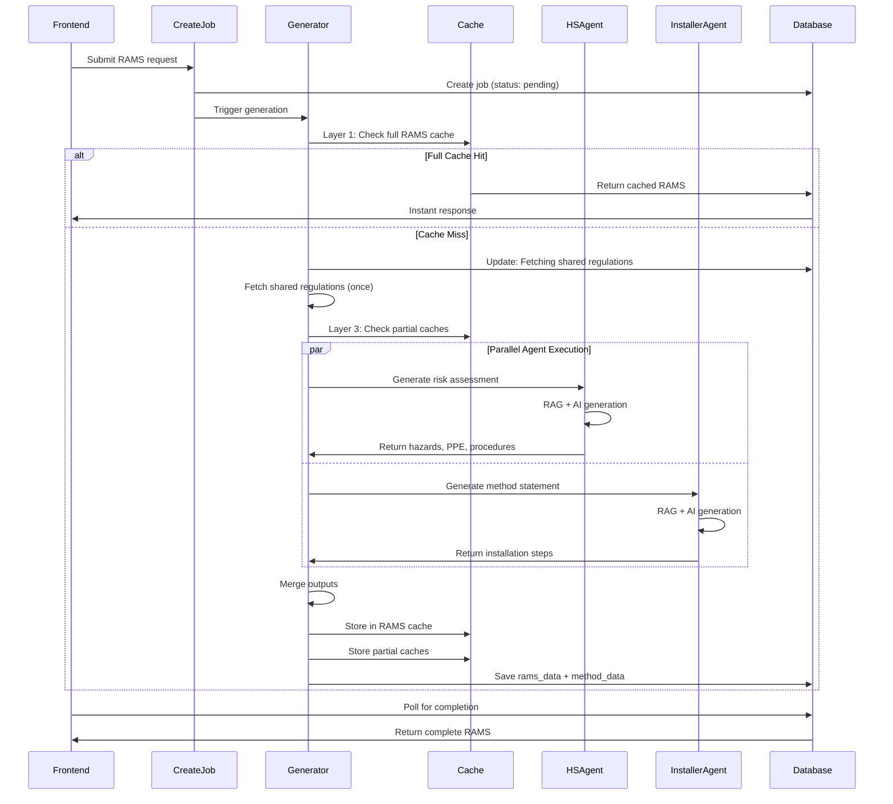

# AI RAMS Generator

## Overview

AI RAMS (Risk Assessment & Method Statement) is a unified generator that produces combined safety documentation. It runs the **Health & Safety Agent** and **Installer Agent** in **parallel**, sharing regulation data between them, then merges their outputs into a complete RAMS package.

## Agents Involved

| Agent | Edge Function | Core Logic | Purpose |
|-------|---------------|------------|---------|
| **Health & Safety Agent** | N/A (inline call) | `_agents/health-safety-core.ts` | Risk assessment generation |
| **Installer Agent** | N/A (inline call) | `_agents/installer-core.ts` | Method statement generation |
| **RAMS Generator** | `generate-rams` | Direct in function | Orchestration & merging |

## Entry Points

- **Frontend**: `src/components/electrician-tools/rams-generator/AIRAMSGeneratorInterface.tsx`
- **Page**: `src/pages/electrician-tools/RAMSGeneratorPage.tsx`
- **Job Creation**: `supabase/functions/create-rams-job/index.ts`
- **Generator**: `supabase/functions/generate-rams/index.ts`
- **Transformers**: `supabase/functions/generate-rams/transformers.ts`

## AI Model

- **Primary**: GPT-5 Mini (`gpt-5-mini-2025-08-07`) via OpenAI API
- **Note**: Both Health & Safety and Installer agents use the same model

## RAG Usage

### Shared Regulations (Fetched Once)

Before parallel agent execution, regulations are fetched once:

```typescript
const sharedRegulations = await searchRegulationsIntelligence(job.job_description);
```

This shared data is passed to both agents to avoid duplicate RAG queries.

### Agent-Specific RAG

| Agent | Table | Purpose |
|-------|-------|---------|
| Health & Safety | `health_safety_knowledge` | HSE guidance, hazard data |
| Health & Safety | `regulations_intelligence` | BS 7671 safety regulations |
| Installer | `practical_work_intelligence` | Installation procedures |
| Installer | `regulations_intelligence` | BS 7671 installation rules |

## Internal Flow



## Three-Layer Caching

### Layer 1: Full RAMS Cache

**Function**: `checkRAMSCache()` / `storeRAMSCache()`
- Checks for identical job descriptions with semantic similarity
- Returns complete RAMS if found
- Instant response (<1s)

### Layer 2: RAG Cache (Reserved)

RAG results are implicitly cached through shared regulations fetch.

### Layer 3: Partial Agent Cache

**Function**: `checkPartialCache()` / `storePartialCache()`
- Caches individual agent outputs
- If H&S cached but Installer not, only runs Installer
- Reduces generation time by ~50% on partial hits

## Input

```typescript
interface RAMSRequest {
  jobDescription: string;           // Work description
  jobScale: string;                 // domestic, commercial, industrial
  projectInfo: {
    projectName: string;
    location: string;
    contractor?: string;
    supervisor?: string;
    assessor?: string;
    siteManagerName?: string;
    siteManagerPhone?: string;
    firstAiderName?: string;
    firstAiderPhone?: string;
    safetyOfficerName?: string;
    safetyOfficerPhone?: string;
    assemblyPoint?: string;
  };
}
```

## Output

### rams_data (Risk Assessment)

```typescript
interface RAMSData {
  projectName: string;
  location: string;
  assessor: string;
  date: string;
  hazards: Array<{
    id: string;
    hazard: string;
    likelihood: number;
    severity: number;
    riskScore: number;
    riskLevel: string;
    controlMeasure: string;
    residualRisk: number;
  }>;
  ppe: Array<{
    itemNumber: number;
    ppeType: string;
    standard: string;
    mandatory: boolean;
    purpose: string;
  }>;
  emergencyProcedures: string[];
  complianceRegulations: string[];
}
```

### method_data (Method Statement)

```typescript
interface MethodData {
  jobTitle: string;
  location: string;
  contractor: string;
  supervisor: string;
  siteManagerName: string;
  siteManagerPhone: string;
  firstAiderName: string;
  firstAiderPhone: string;
  safetyOfficerName: string;
  safetyOfficerPhone: string;
  assemblyPoint: string;
  steps: Array<{
    id: string;
    stepNumber: number;
    title: string;
    description: string;
    safetyRequirements: string[];
    equipmentNeeded: string[];
    materialsNeeded: string[];
    qualifications: string[];
    estimatedDuration: string;
    riskLevel: string;
    linkedHazards: string[];
    dependencies: string[];
  }>;
  toolsRequired: string[];
  materialsRequired: string[];
  practicalTips: string[];
  commonMistakes: string[];
  testingProcedures: any[];
  bs7671References: any[];
}
```

## Job Database Table

**Table**: `rams_generation_jobs`

| Column | Type | Description |
|--------|------|-------------|
| `id` | UUID | Job identifier |
| `user_id` | UUID | Owner |
| `status` | TEXT | pending, processing, complete, partial, failed, cancelled |
| `progress` | INTEGER | 0-100 |
| `current_step` | TEXT | Current processing stage |
| `hs_agent_status` | TEXT | Health & Safety agent status |
| `hs_agent_progress` | INTEGER | Health & Safety progress (0-100) |
| `installer_agent_status` | TEXT | Installer agent status |
| `installer_agent_progress` | INTEGER | Installer progress (0-100) |
| `job_description` | TEXT | Work description |
| `job_scale` | TEXT | domestic/commercial/industrial |
| `project_info` | JSONB | Project metadata |
| `rams_data` | JSONB | Risk assessment output |
| `method_data` | JSONB | Method statement output |
| `cache_hit` | BOOLEAN | Whether served from cache |
| `error_message` | TEXT | Error details if failed |

## Progress Zones

Overall progress is calculated from agent progress:

| Zone | Range | Description |
|------|-------|-------------|
| Initialization | 0-10% | Job setup, cache checks |
| H&S Agent | 10-50% | Health & Safety generation |
| Installer Agent | 50-90% | Method statement generation |
| Finalization | 90-100% | Merging, saving, caching |

## Partial Success Handling

The generator handles partial failures gracefully:

| H&S | Installer | Result |
|-----|-----------|--------|
| ✓ | ✓ | Complete RAMS |
| ✓ | ✗ | Partial (risk assessment only) |
| ✗ | ✓ | Partial (method statement only) |
| ✗ | ✗ | Failed |

## Developer Notes

### Modifying the Generator

1. **Shared RAG**: Edit `searchRegulationsIntelligence()` call
2. **Agent Calls**: `generateHealthSafety()` and `generateMethodStatement()` in `_agents/`
3. **Output Transform**: `transformHealthSafetyResponse()` in `transformers.ts`
4. **Cache Functions**: `_shared/rams-cache.ts` and `_shared/rams-partial-cache.ts`

### Progress Callback Pattern

Both agents receive progress callbacks:

```typescript
async (progress: number, step: string) => {
  if (await checkCancelled()) throw new Error('Job cancelled');
  await updateAgentProgress('hs', progress, 'processing', step);
}
```

### Cancellation Support

Job can be cancelled at any point:
- Checks `status === 'cancelled'` in database
- Throws error to stop agent execution
- Frontend calls `cancel-rams-job` function

### Common Issues

- **One agent fails**: Returns `partial` status with available data
- **Both agents fail**: Returns `failed` status with error messages
- **Cache miss on similar job**: Check semantic similarity threshold
- **Slow generation**: Check RAG performance, consider reducing document limits
