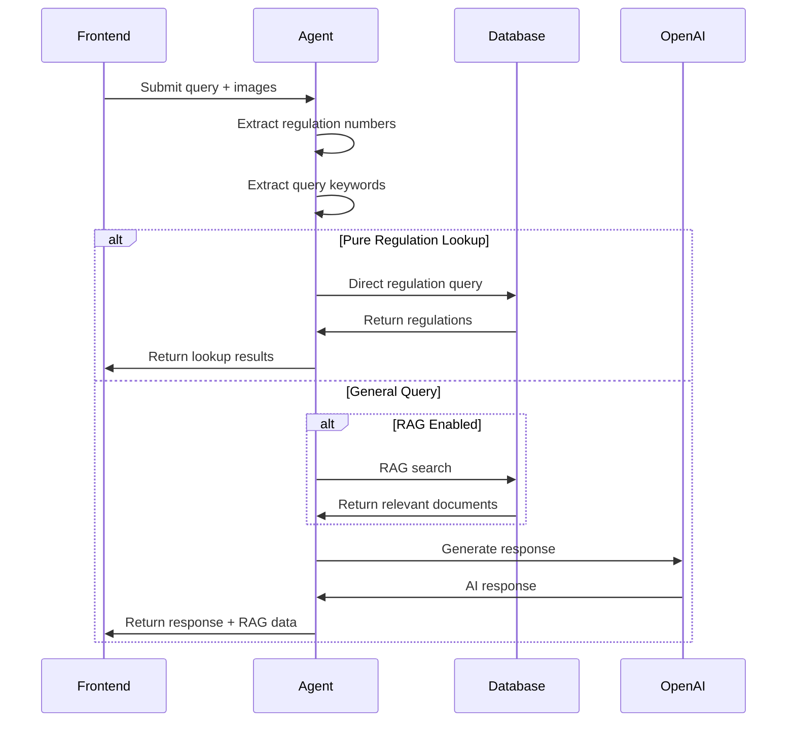

# AI Assistant (Electrician AI Tools)

## Overview

The AI Assistant is a general-purpose conversational agent for electricians. It answers BS 7671 regulation queries, provides practical guidance, and can optionally use RAG to retrieve relevant regulations and installation knowledge. It also supports image analysis for visual fault diagnosis.

## Agents Involved

| Agent | Edge Function | Purpose |
|-------|---------------|---------|
| **AI Assistant** | `electrician-ai-assistant` | Conversational AI for regulation lookup and guidance |

## Entry Points

- **Frontend**: `src/components/electrician-tools/ai-assistant/AIAssistantInterface.tsx`
- **Page**: `src/pages/electrician-tools/AIAssistantPage.tsx`
- **Agent**: `supabase/functions/electrician-ai-assistant/index.ts`

## AI Model

- **Primary**: GPT-4.1 (`gpt-4.1-2025-04-14`) via OpenAI API
- **Vision**: Supports image analysis for fault diagnosis

## RAG Usage

### Direct Regulation Lookup (Fast Path)

Before using RAG, the assistant checks for direct regulation lookups:

```typescript
const isPureRegulationLookup = (query: string): boolean => {
  // Returns true if query is just regulation numbers (e.g., "411.3.3, 522.6")
}
```

If true, directly queries `regulations_intelligence` table without embedding generation.

### RAG Sources (when `use_rag = true`)

| Table | Purpose |
|-------|---------|
| `regulations_intelligence` | BS 7671 regulations with enriched metadata |
| `bs7671_embeddings` | Full regulation text with vector embeddings |
| `practical_work_intelligence` | Installation/testing procedures |

### Keyword-Based Lookup

Extracts keywords from queries:
- Amperage patterns (e.g., "32A")
- Circuit types (e.g., "ring circuit", "radial")
- Technical terms (cable sizing, RCD, protection, etc.)

## Internal Flow



## Input

```typescript
interface AIAssistantRequest {
  prompt: string;                   // User query
  type?: 'general' | 'regulation' | 'fault' | 'calculation';
  primary_image?: string;           // Base64 image for visual analysis
  additional_images?: string[];     // Additional images
  context?: {
    previousMessages?: any[];
    projectContext?: any;
  };
  use_rag?: boolean;                // Enable RAG retrieval
}
```

## Output

### Lookup Mode (Direct Regulation)

```typescript
interface LookupResponse {
  success: boolean;
  lookup_mode: true;
  regulations: Array<{
    id: string;
    regulation_number: string;
    section: string;
    content: string;
    amendment: string;
    metadata: any;
    similarity: number;
    primary_topic: string;
    keywords: string[];
    category: string;
    practical_application: string;
  }>;
  rag_regulations: any[];           // Same as regulations (for panel)
  rag_metadata: {
    search_method: 'direct';
    has_installation: boolean;
    has_testing: boolean;
    has_design: boolean;
    query_type: 'lookup';
  };
  message: string;
}
```

### General Query Mode

```typescript
interface GeneralResponse {
  success: boolean;
  response: string;                 // AI-generated answer
  rag_regulations?: any[];          // Retrieved regulations
  rag_installation?: any[];         // Retrieved installation docs
  rag_testing?: any[];              // Retrieved testing docs
  rag_metadata?: {
    search_method: string;
    has_installation: boolean;
    has_testing: boolean;
    has_design: boolean;
    query_type: string;
  };
}
```

## Query Types

| Type | Description | RAG Behaviour |
|------|-------------|---------------|
| `general` | General electrical questions | Optional RAG |
| `regulation` | BS 7671 regulation queries | Direct lookup preferred |
| `fault` | Fault diagnosis | Practical work RAG |
| `calculation` | Electrical calculations | Design knowledge RAG |

## Regulation Number Extraction

```typescript
const extractRegulationNumbers = (query: string): string[] => {
  const regPattern = /\b(\d{3}(?:\.\d+){0,2})\b/g;
  const matches = query.match(regPattern) || [];
  return [...new Set(matches)]; // Deduplicate
};

// Examples:
// "411.3.3" → ["411.3.3"]
// "522.6, 522.7" → ["522.6", "522.7"]
// "What does reg 411 say" → ["411"]
```

## Developer Notes

### Modifying the Agent

1. **Regulation Lookup**: Edit `getRegulationsDirect()` function
2. **Keyword Extraction**: Edit `extractQueryKeywords()` function
3. **RAG Integration**: RAG search is optional via `use_rag` flag
4. **System Prompt**: Defined inline for each query type

### Image Analysis

When `primary_image` is provided:
- Sent to GPT-4.1 vision endpoint
- Used for visual fault diagnosis
- Supports multiple images via `additional_images`

### RAG Panel Population

The response includes structured RAG data for frontend panels:
- `rag_regulations` - For regulation reference panel
- `rag_metadata` - For showing search method and coverage

### Common Issues

- **Empty regulation lookup**: Check `regulations_intelligence` table has matching regulation numbers
- **Slow response**: Direct lookup is faster than full RAG - ensure pure lookups are detected
- **Image analysis fails**: Check image is valid base64 and within size limits

### Timeout Configuration

Default edge function timeout applies. For complex queries with multiple images, consider chunking.
